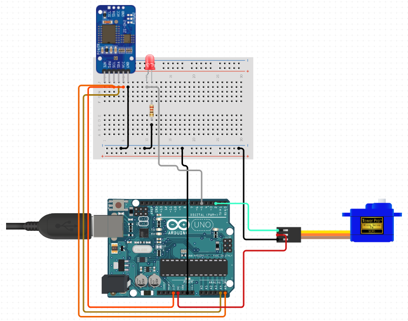

#catfeeder

Automated cat feeder I built for a neighbor who is away at work for long hours to feed his cat at specified intervals during the day. 

Parts list: Arduino Uno, 9g Servo, DS1307 RTC, 5mm LED (red), 330 ohm resistor

Circuit image: (note: actual pin layout as written in the code file. Tinkercad didn't have a module for RTC so I had to use an automated service to include the device in the diagram)

